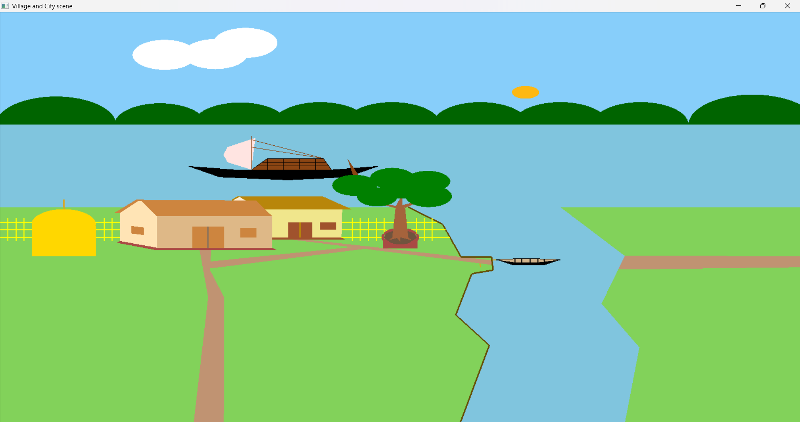
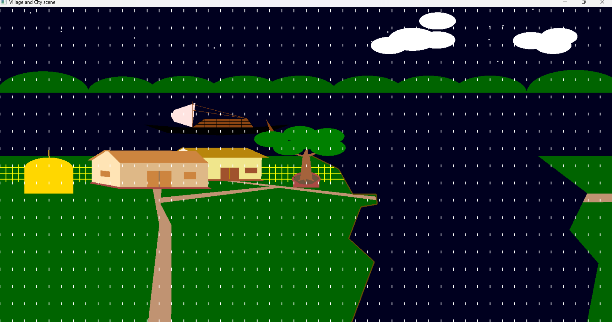
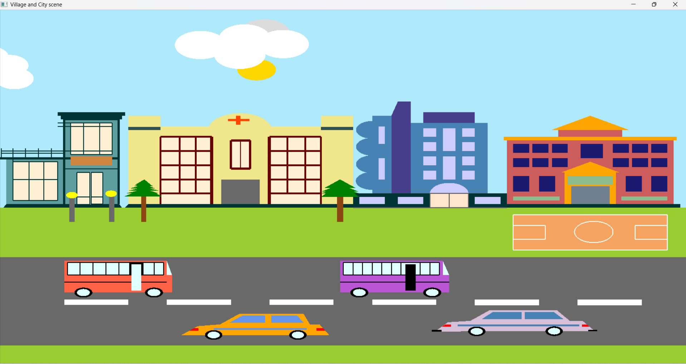

# OpenGL Village and City Scene Simulator




This is a Computer Graphics project built using OpenGL and GLUT in C++. It simulates two interactive 2D scenes: a **Village** and a **City**, with day/night modes, moving vehicles/boats, clouds, rain (in village), and a flying plane (in city). The project demonstrates 2D graphics rendering, animations, and user input handling using keyboard and mouse controls.

## Features
- **Two Scenes**:
  - **Village**: Houses, trees, rivers, moving boats, clouds, and rain effects.
  - **City**: Buildings (hospital, food court, hotel, school), roads, moving buses/cars, clouds, and a flying plane.
- **Day/Night Toggle**: Switch between day and night with dynamic sky, sun/moon, and lighting changes.
- **Animations**:
  - Moving boats (village), buses/cars (city), clouds, and plane.
  - Rain effect in the village with falling raindrops and river waves.
- **Interactive Controls**:
  - Keyboard for scene switching, day/night, movement control, rain, and plane flight.
  - Mouse for adjusting vehicle/boat speed.
- **Rendering**: Uses GL_POLYGON, GL_LINES, and circles (via loops) for shapes like buildings, vehicles, and trees.

## Controls
- **Scene Switching**:
  - `v`: Switch to Village scene.
  - `c`: Switch to City scene.
- **Day/Night**:
  - `d`: Day mode.
  - `n`: Night mode.
- **Movement**:
  - `s`: Stop vehicles/boats.
  - `m`: Start/resume vehicles/boats.
- **Village-Specific**:
  - `r`: Start rain.
  - `b`: Stop rain.
- **City-Specific**:
  - `f`: Start flying the plane.
- **Mouse Controls**:
  - Left Click: Speed up vehicles/boats.
  - Right Click: Slow down vehicles/boats.

## Screenshots
### Village Day Mode


### Village Night Mode with Rain


### City Day Mode


## Prerequisites
- **Compiler**: GCC or any C++ compiler (e.g., MinGW for Windows).
- **Libraries**:
  - OpenGL (GL, GLU).
  - GLUT (freeglut recommended).
- **OS**: Tested on Windows (MinGW/Code::Blocks). Should work on Linux/Mac with minor adjustments.

## Installation
1. Clone the repository:
   ```bash
   git clone https://github.com/yourusername/your-repo-name.git
   cd your-repo-name
